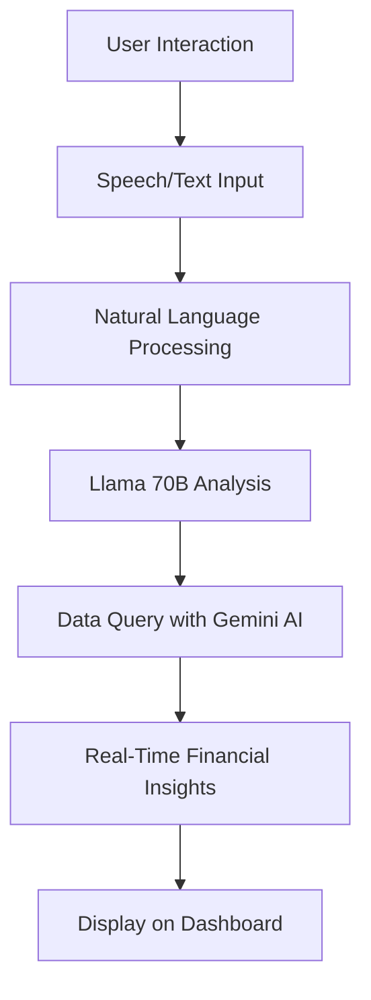

# Corpus Finance


## Table of Contents
- [Overview](#overview)
- [Features](#features)
- [Architecture & Illustrations](#architecture--illustrations)
- [Installation & Setup](#installation--setup)
- [Usage](#usage)
- [Contributing](#contributing)
- [License](#license)
- [Contact](#contact)

## Overview
Corpus Finance is a comprehensive financial analysis platform that provides detailed insights into company statistics, market trends, and future forecasts. By integrating cutting-edge AI models and speech interaction, the project offers an interactive and intelligent experience for users to discuss and explore financial data.

### Key Highlights:
- **End-to-End Analysis:** Complete story-based evaluation of companies.
- **Interactive AI:** Utilizes advanced LLMs for natural language queries and dynamic responses.
- **Speech Integration:** Seamless voice interaction powered by speech-to-text and text-to-speech APIs.
- **Hybrid AI Models:** Leverages Llama 70B for generating financial insights and Gemini AI for data-driven interactions.

## Features
### Company Analysis Story
A narrative-driven approach to analyze company statistics, covering historical performance and future projections.

### Speech-Enabled Interactions
Engage with the platform using voice commands for a hands-free experience.

### Advanced AI Integration
- **Llama 70B:** Provides versatile, prompt-based analysis.
- **Gemini AI:** Interacts with the underlying data to answer queries and provide real-time insights.

### Real-Time Data Processing
Offers updated and accurate information for dynamic financial analysis.

### Customizable Dashboard
A user-friendly interface that lets you visualize data through charts, graphs, and interactive modules.

## Architecture & Illustrations
### System Architecture
The platform integrates multiple components that work together seamlessly:

- **Data Ingestion:** Fetches and processes financial data in real time.
- **AI Processing:** Uses Llama 70B for natural language processing and Gemini AI for querying the dataset.
- **Speech Interaction Module:** Implements speech-to-text conversion for commands and text-to-speech for responses.
- **Web Interface:** A responsive dashboard that presents the analysis, reports, and visualizations.


### Workflow Illustration
Below is a flowchart representing the user interaction process:



## Installation & Setup
Follow these steps to set up Corpus Finance on your local machine:

### Clone the Repository
```sh
git clone https://github.com/GaganMishra305/Corpus-Finance.git
cd Corpus-Finance
```

### Install Dependencies
Ensure you have Python installed, then run:
```sh
pip install -r requirements.txt
```

### Configure Environment
- Set up your API keys and configuration parameters in the `.env` file.
- Update the configuration files as needed to point to your data sources.

### Interact via Speech
Use your microphone to ask questions about company performance, forecasts, or any financial metric.

### Explore the Dashboard
Navigate through various sections, including statistical reports, analysis stories, and data visualizations.

### Engage with AI
Ask for detailed narratives, future projections, and step-by-step insights powered by Llama 70B and Gemini AI.

## License
This project is licensed under the MIT License. See the [LICENSE](LICENSE) file for more details.
 